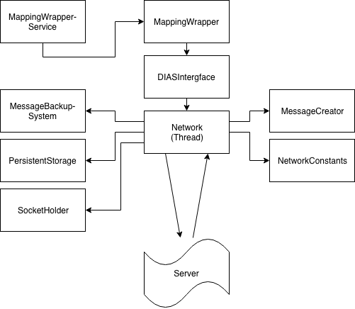

.. highlight:: java
******************
DIASClient Library
******************

Introduction
------------

This documentation explains everything you need to know about the DIASLibraryLight and how to use it.

The DIASLibraryLight is a library, which gives developers easy access to their implementation of the DIAS server and deals with the communication and its problems.
It also contains a description of all core classes, if someone would like to add some parts to the library.  Note that in that case, there may be further thread-synchronisation needed.

Use case
--------
This library connects the desired app to the DIAS server for easy and fast communication.  It enables users to share their data with the network and have access to the shared aggregated data of others, such as the average value, the sum of all, the standard deviation, the maximum and minimum value and the count of all peers.

An example: Imagine you and some other people have some data, let's say grades of an exam. Now, you would like to share those grades amongst each other to calculate the minimum and maximum value, as well as the average, the standard deviation and how much people participated. The problem is, that maybe some of the people would rather have this information private.  With the server and this library, this could easily be handled as follows:

Someone simply has to create an app using this library, in which the user gets asked to insert his grade. The app then sends the possible states to a peer in the network (for example in Switzerland we have grades from 1 to 6, with steps of 0.25, so the states would be{1, 1.25, 1.5, ...  , 5.75, 6}), and then sends the selected state, mapped to the closest state along as well. Every participant can now easily access all the above mentioned aggregates, without having access to any data from any particular user.

Installation
------------
To use this library, one must simply add it to its own android application in a new Package, that's all!

**Note:** Don't forget to add the permission to use internet access in the android manifest.
::
	<uses-permission android:name="android.permission.INTERNET" />

Usage
-----
This section explains everything you need to know to correctly use the library.

Initialisation
##############
The usage is rather easy, one just has to initialise an instance of the class.
::
	MappingWrapperService server = new MappingWrapperService();
Once this is done, the communication with the server can begin.

**Note:** Currently, the the MappingWrapper and MappingWrapperService are not guaranteed to be thread safe. Because of that, please try to only use one thread with one instance of the class.

**Note:** You can also use the MappingWrapper class, but then you need to close the class before nulling it! The MappingWrapperService handles that for you.

The usage of sensorIDs
######################
With almost every method, one must give a sensor ID, but what is it used for?

The sensorID is needed, such that the server can distinguish between different addressed peers.
The library can communicate with multiple peers, all are considered as a new participant of the network, as long as the sensorIDs are different for each of those peers.
The IDs do not have to be different for different devices, but they have to be different for different peers on the same device.

For example:  Bob has two connections, one with peer 20 and peer 21, so he has two peers, for which only he has access to.
Alice also has two peers, 19 and 20. The two peers with ID 20 are not the same, as they are distinguished on the server side.

Sending data to the server
##########################
There are two types of data messages, which can be sent: possible states and selected state messages.

When sending a (or a reading), the value internally gets matched tot he closest possible state. This is why it's important to always have a) existing possible states and b) possible states, which are somewhat reasonable for the possible data.

For Example, it doesn't make sense to have possible states in the range [500, 600], if all values are between 1 and 10. The closer the possible states lie to the possible values, which are inserted, the more accurate are the aggregates.

Sending possible states
***********************
To create suiting possible states, there are already 3 methods to create them automatically. Additionally, one can pass a custom array of possible states.
::
	//create possible states with step size 1 from 0 up to n (included)
	server.setPossibleStatesRange(String sensorID, int n);

	//create possible states with step size 1 from lower up to upper (both included)
	server.setPossibleStatesRange(String sensorID, int lower, int upper);

	//create possible states with given step size from lower up to upper (both included)
	server.setPossibleStatesRange(String sensorID, double lower, double upper, double steps);

	//insert custom possible states
	server.setPossibleStates(String sensorID, double[] states);

Sending evaluated values
************************
To send a value, the server must have already received some possible states (see 4.3.4.3). To set a value, one has to call the following method:
::
	server.sendReading(String sensorID, double... readings);

If multiple values are given, the library calculates the average and matches it to the nearest possible state.

**Note:** A new reading overwrites the old reading, int the library, as well as in the server side.

Receiving data from the server
##############################
In order to receive any aggregates from the server, the addressed peer needs to start it's aggregation protocol.
This is done after successfully sending possible and selected states. The following aggregates can be retrieved:

* average (avg)
* summation (sum)
* standard deviation (stdev)
* maximum value (max)
* minimum value (min)
* count of all peers (count)

To request a specific aggregate, one must call the following method:
::
	// The aggregation type is an enum
	server.getAggregate(String sensorID, AggregationType aggregationType);

The returned value is an instance of the AggregateResult class, which is explained shortly.

The AggregateResult class
#########################
This class has some similarities with the Future class.
It will return a value, once it’s received from the server, or return null ,if an internal communication error happened.

The isCancelled method will tell, if there was an error and the isReceived method with tell if anything was received.

The method isFinished merges those two together and tells if either a value was received, or the process was cancelled. The isStillRunning method is basically a negation of the isCanclled method.

Getting a result
****************
There are 3 ways to aces a value:
::
	aggregateResult.get(); //1
	aggregateResult.get(long waitingPeriod); //2
	aggregateResult.getImmediately(); //3

The first one is to not specify any waiting period.
In this case, the caller waits until a value is received, or the process gets cancelled. This could potentially be dangerous, if the server never answers (Deadlock).

The second one takes a waiting period. The caller waits until the waiting period is  ver for a result. If until then  nothing is received, or the process gets cancelled, it returns null.

The third one is the shortest. The caller checks, if there is already a value received. If not, it immediately returns null.  Notet hat the communication to the server could take some time and is not immediate.

It is advised to use the second one, as a) it does not introduce any deadlocks, and b) it waits a given amount of time, to give the server the ability to answer.

It may be a good idea to do something on the side instead of just waiting for a result. Also, maybe for that part, a thread should be used, as otherwise it may block the user interface during the waiting

Resetting the database
######################
The library stores already established addresses to peers internally, in order to relieve the workload from the gateway.

If for any reason the saved addresses need to be re-fetched, e.g.  when the server is restarted and the sockets have dynamic addresses, the internal database needs to be cleared.

To do that, the method reset() (from either the MappingWrapperService or the MappingWrapper) needs to be called.
Please Note that this only clears the database and does not close any already established connections. This means that this method needs to be called before any communication with the server. This also includes unsuccessful connection attempts, which means basically any call of any method, which would send something to the server (i.e. setting of possible states, setting of selected states, getting of aggregates etc.).

If  any  of  those  methods  were  already  called,  the  instance  of  the  controller  (MappingWrapperService,  MappingWrapperor DIASInterface) needs do be correctly closed and e new instance needs to be instanciated.

Overview
--------

Above, you see an overview of the library and its parts.

The topmost part is the MappingWrapperService, which is a wrapperclass of the Mappingwrapper. The Mappingwrapper itself is a wrapperclass of the DIASInterface class and accesses the DIASInterface, which is the controller, we will get a deeper view in  he  following sections.

The DIASInterface controls the Network class, which is the heart of thew hole library.

The Network class has access to the MessageBackupSystem, the PesistentStorage, the SocketHolder, the MessageCreator and the NetworkConstants.

The parts
---------
I this section, we will take a deeper look at the different classes shown in the overview.

MappingWrapperService
#####################
The MappingWrapperService is a clean version of the MappingWrapper. It has all the methods od the MappingWrapper, except close(), which is handled automatically upon nulling the element.

MappingWrapper
##############
This class is a wrapper class of the DIASInterface class with some extra feature like the calculation of the average value, when multiple values are given.

DIASInterface
#############
This class controls the interaction with the network class upon user input. In the following, there is short explanation of all methods, deprecated methods are omitted.

Constructor
***********
In the constructor, the DIASInterface initialises the Network class and starts the underlying thread.

setPossibleStates
*****************
This method appends a PossibleStatesMessage for the DIAS server to the queue of the network thread. In the message, it sends the given possible states.

setReading
**********
This method appends a SelectedStatesMessage for the DIAS server to the queue of the network thread. Int the message, it sends the given selected state.

getAggregate
************
This method returns an instance of the AggregateResult class, given a sensorID and an AggregationType, the AggregateResult is explained later on.

leave
*****
This method appends a LeaveMessage for the DIAS server to the queue of the network thread. One should always call this method if there is not further interaction with a certain SensorID.

reset
*****
This method deletes all previously store IP addresses of all peers. It is important, that this method is called **before** any communication with the server, since the IP addresses of ongoing communication will not be changed. This method should always be called, when the server is reset and it's peers possibly received new IP addresses.

cleanClose
**********
This method always need to be called, before nulling the object, since the running thread of the network class need to be stopped.

isOnline
********
This method returns true, if there is a working communication with the server. Note, that if there was no initial communication yet, or all peers left again, it will return false. It will also return false, if it initially could connect, but it can’t anymore, for any reason.

startAgg
********
This method need to be called, to start the aggregation process on the server side.

getNOKs
*******
This method is more for debugging reasons, it returns an ArrayList with up to the 50 last NOK messages from the server, contained in NOKError classes, explained further on.

getTimeoutReports
*****************
This method is more for debugging reasons, it returns an ArrayList with up to  the 50 last TimeoutReports stored. TheTimeoutReport is also explained further on.

Network
#######
The Network class is the heart of the whole library, it makes use of several subclasses for Communication, basic error correction, and data retrieval from the server. The Network class has an internal thread, which sends all Messages stored in the internal queue and listens to the answers from the server.

Constructor
***********
In the constructor, the Network class initialises its internal message queue, its MessageBackupSystem, its PersistentStorage, the MessageCreator, its Mapping for all communication sockets, an array to keep track of all ongoing communication lines, a buffer for all aggregates returned from the server,  a buffer for messages for non-initialised sockets, and the lists for threceived NOKs and logged timeouts. All classes will be explained later on.

getAggregate
************
Sends an aggregate request to the server. The method returns an instance of the AggregateResult class, which is explained later on.

handleAggregateMessage (private)
********************************
This method, given a received message String from the server, evaluates what aggregation type was received, and from which sensorID the request came from. It then stores the value to the correct AggregateResult class, making it possible to retrieve the result for all owners of this instance of the Aggregate class.

closeAll
********
This method closes the Network class and its underlying thread. it also closes all its open sockets, connected to the server.
This method should always be called before nulling the object.

sendNextMessage (private)
*************************
This method is called from the Network thread, if there was no response from the server to a specific message after a given timeout, this timeout can be changed in the NetworkConstants class, named with ”CONNECTIONTIMEOUT”, explained later on.

savePeerAddress (private)
*************************
This method is called from the internal thread, when the gateway returned an IP address for a newly requested peer. The address then gets stored in the PersistentStorage class. With the given address, a new Socket will be initialised. Then, it will get checked, if there are already some internally stored messages for this peer in the general buffer. If so, those messages get put into the queue of the specific peer.

sendTimeoutMessage (private)
****************************
This method is called upon initially receiving a new address. It sends the desired timeout to the server, after which, if no messages received, the peer should go offline. The value of this timeout is stored in the NetworkConstants class, named with "PEERTIMEOUT".

handleAckMessage (private)
**************************
This method checks the given response from the server, if it is an ErrorMessage. If so, the errorCode gets extracted and the error then, if possible, gets automatically corrected.

Some basic error handling, concerning problems with possible and selected states are alreay implemented, but the switch/case statement can easily be expanded.

resendPSPrioritized (private)
*****************************
This method creates a new possible states message and appends it to the front of the queue of the corresponding socket. Only used for error handling.
The possible states are extracted from the MessageBackupSystem, which stores the most recent possible and selected states for all sensorIDs.

resendSSPrioritized (private)
*****************************
This method creates a new selected state message and appends it to the front of the queue of the corresponding socket. Only used for error handling.
The selected state are extracted from the MessageBackupSystem, which stores the most recent possible and selected states for all sensorIDs.

recreateLastSentMessage (private)
*********************************
This method, given a certain sensorID, gets the last sent Message from the method "getLastSentMessageString", which then gets evaluated and recreated.

getLastMessageString (private)
******************************
Given a certain sensorID, the method extracts the corresponding socket from the internal mapping, and then extracts the last sent message from the socket, which is stored internally.

determineErrorCode (private)
****************************
This method determines the errorCode, given an AckMessage

sendReceiveHandle (private)
***************************
This method is frequently called from the internal thread. It goes through all peers and checks if there are any answers from the server side. If so, the online tag is set and the message get evaluated. If not and the timeout limit is reached, a timeoutReport is created, and the next message from the queue is sent.

appendTimeoutReport (private)
*****************************
This method creates a timeoutReport and appends it to the corresponding queue. If the queue has more elements than allowed, the oldest report is dropped.

appendNOKError (private)
************************
This method creates a NOKError and appends it to the corresponding queue. If the queue has more elements than allowed, the oldest report is dropped.

getSavedTimeoutReports
**********************
Returns an ArrayList with up to the last 50 TimeouOutReports

getReceivedNOKs
***************
Returns an ArrayList with up to the last 50 NOKErrors

prepareSend (private)
*********************
This method takes the given message and puts it in the queue of the corresponding socket. If the socket is not yet created, it gets saved in a general buffer.

appendInGeneralBuffer (private)
*******************************
This method saves the given method in the general buffer under the corresponding ID.

handleMessage (private)
***********************
This method is frequently called from the internal thread. It take an element of its internal message queue and puts it in the queue of the corresponding socket.

handleHearBeats (private)
*************************
This method is frequently called from the internal thread. It checks if the heartbeat timeout is already reached. If so, it sends a HeartBeatMessage for all currently established and open connections.
The heartbeat timeout is half of the peer timeout, stored in the NetworkConstants class.

getSocket (private)
*******************
This method is called, if a desired socket is not yet in the internal mapping. It either returns a new instance of the socket, if the corresponding address is already established, or asks the server for a new peer and returns null.

requestSocket (private)
***********************
Requests a socket from the gateway.

isOnline
********
Returns true, if currently, there is an established and working connection to (at least some of) the peers.

setOnline (online)
******************
Internally sets the online boolean to true/false.
Also saves when the class was online the last time.

appendMessage (private)
***********************
Appends a message for the server in the internal message queue for the server. Returns true upon success.

appendPriorizedMessageDirectlyToSocket (private)
************************************************
This method is made for error correcting messages. They directly get put on front of the queue of the corresponding socket.

retreiveMessage (private)
*************************
This method is frequently called from the internal thread, pulls the first Message from the message queue.

toJson (private)
****************
Converts a message from the server to a json String.

retreiveSensorID (private)
**************************
Retrieves the corresponding sensorID of a given Message.

appendHeartBeatMessage (private)
********************************
Appends a heartbeat message for the given sensorID to the message queue handled by the internal thread.

appendPSMEssage1D
*****************
Appends a one dimensional possible states message to the message queue handled by the internal thread.

appendSSMessage1D
*****************
Appends a one dimensional selected states message to the message queue handled by the internal thread.
The selected state gets evaluated by the given possible states. The given value gets matched to the nearest possible state.

appendLeaveMessage
******************
Appends a leave message to the message queue handled by the internal thread.

appendStartAggregationMessage
*****************************
Appends a startAggregationMessage to the message queue handles by the internal thread.

AppendAggregationRequestMessage (private)
*****************************************
Appends a AggregationRequestMessage to the queue handled by the internal thread.

matchUpSelectedStateToPossibleStates
************************************
given a value, determines the index of the possible state with the smallest difference.

MessageBackupSystem
###################
The MessageBackupSystem backs up the last set possible and selected states, such that on a communication error, the Network class could recover not sent messages.

Constructor
***********
In the constructor the MessageBackupSystem initialises the mappings for the possible and selected states and loads saved values from the storage

saveSelectedState
*****************
Updates the mapping of the given ID with the new selected state.

savePossibleStates
******************
Updates the mapping of the given ID with the new possible states.

getSelectedState
****************
Returns the latest selected state in a special container.

getPossibleState
****************
Returns the latest possible states as a double array.

backupData (private)
********************
Saves the mappings persistently in memory.

close
*****
Closes this instance and backups the data.
Should be called before nulling the object. Otherwise, all updated data is lost.

PersistentStorage
#################
The PersistentStorage is responsible for backing up all connection information for the server.

Constructor
***********
Initialises the address mapping.

put
***
Saves the given address to the given key, connected with a timestamp.

remove
******
Removes the address for the given ID.

get
***
Returns the Connection Information for the given ID.

savePersistent
**************
Backs up the current data to memory, is always called, when a data point is updated.

getUUID
*******
Returns a the unique user ID.
Currently, it is set to the Android ID.

savePeerInfo
************
Saves a mapping for the given SensorID to the given peerID.

SocketHolder
############
The SocketHolder is a custom implementation of the ZMQ socket, which has its own Queue for pending messages.
It also saves the time and value of the last sent message, for error correction.

Constructor
***********
In the constructor, the the connection to the server gets established, as well as the message queue.

putmsg
******
Puts the given message to the end of the internal message queue.
If the queue reaches the specified limit, the oldest message gets dropped. The limit can be changed in the NetworkConstants class.

putOnFront
**********
Puts the given Message to the front of the queue, this is used for urgent error correcting messages.
If the queue reaches the specified limit, the oldest message gets dropped. The limit can be changed in the NetworkConstants class.

sendmsg
*******
Takes the head of the queue and sends it to the server and updates the timestamp and the last sent message.

getLastSentMessage
******************
Returns the last sent message. If no message was sent yet, it returns null.

resetSocket
***********
Upon errors, the socket can be reset with this method. It closes the current connection and establishes a new one.

MessageCreator
##############
The MessageCreator converts the given data to a message, which is understood from the server.
At the moment, it is possible to create the following:

* One dimensional possible states message
* one dimensional selected states message
* leave message
* aggregate request message
* address request message
* timeout message
* start aggregation message
* heartbeat message

NetworkConstants
################
This class contains all constants for easy access. The following values can be read and changed:

* buffer size of socket
* the prefix for the sensors (naming convention of server)
* the internal ID for the gateway
* the used protocol, currently TCP
* the UUID port
* the connection timeout for replies
* the timeout for the library to change the internal flag back to offline
* the timeout for the server
