.. highlight:: java
********************
Smart Agora Tutorial
********************

Introduction
************

About this Tutorial
-------------------

This user guide introduces you to the functionalities of Smart Agora and guides you on how you can easily create your own projects, experiments, and data collection. It guides you by listing the step-by-step procedure of crowdsourcing tasks in an automated way by the application, combined with extensive use of application screenshots, cross-references, and supplementary notes. All this is meant to give you a good understanding of the Smart Agora application and the crowd-sourcing dashboard in order to make use of it right away.

Smart Agora
-----------

**Smart Agora** provides a data-collection approach for data scientists by active participation in smart cities in which the experiment participants collect data by using simple yet ethically sensitive technology. Data scientists can autonomously initiate collective movements about data collection in an urban environment. These collective movements can be easily orchestrated by defining augmented points of interest in public urban space. The participants of an experiment can explore with their smartphones and in a gamified way these points while they anonymously share informed opinions and highly relevant contextual (sensors) data.
Smart Agora platform consists of the following two core components:

* Crowd-sourcing Dashboard
* Smart Phone Application

Chapter 1 - Crowd-sourcing Dashboard
************************************

Data scientists and experiment participants both can create user-centric interactions such as questionnaires or surveys using the crowd-sourcing participation dashboard. The participation dashboard requests data and opinions from experiment participants in the public space of interest by crowd-sourcing tasks. These tasks are deployed at different points of interest in the public space, transforming them into augmented reality and making a highly interactive experience. The data scientist can log on to the crowd-sourcing dashboard to perform their respective tasks.
(A System Diagram will be added later)

Logging on to Dashboard
-----------------------

On accessing the **Crowd-sourcing** dashboard by visiting the following link http://195.201.58.108:9000/, the **Login** window appears, as shown in :numref:`Figure 1`. The purpose of this window is to secure the application from unauthorized access. You need to provide your authorized application Email ID and password in order to log on to the system successfully.

.. _Figure 1:
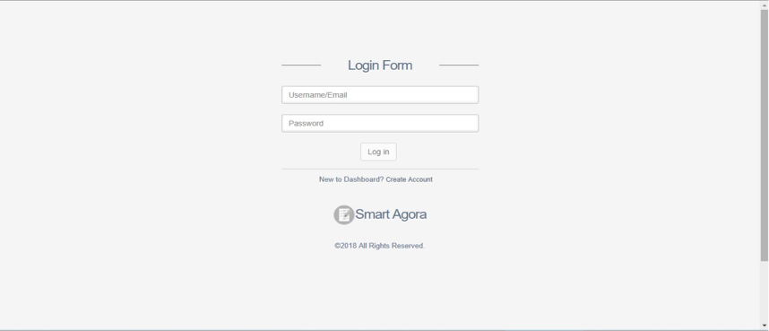

    **Login Window**

If you do not have credentials to access the system, click on “Create Account” and the following screen will appear for registration.

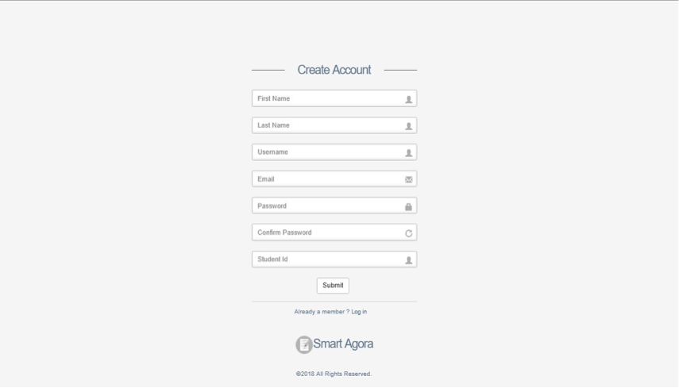

    **Create an Account**

a. Enter your first name in the First Name field.
b. Enter your last name in the Last Name field.
c. Enter your username in Username field.
d. Enter your email id in the Email field.
e. Enter your password in the Password field.
f. Enter your password again to Confirm Password.
g. Enter your Student ID in the Student ID field.

1. Click on Submit to proceed with account creation.

If you already have user credentials, please proceed with login.

1. Enter your Email ID or Username in the Email/Username field.
2. Enter your password in the Password field.
3. Click Log In.

Home Page
---------

On successful login, the home page is displayed. This page appears as shown below

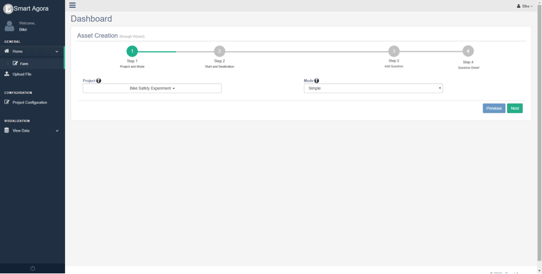

    **Dashboard Home Screen**

There is an option to update the profile or password by clicking the right menu (user icon) on the dashboard as shown in :numref:`Figure 4`. It allows updating user’s information on the profile page (except the username and e-mail address that are considered unique for every registered user).

.. _Figure 4:
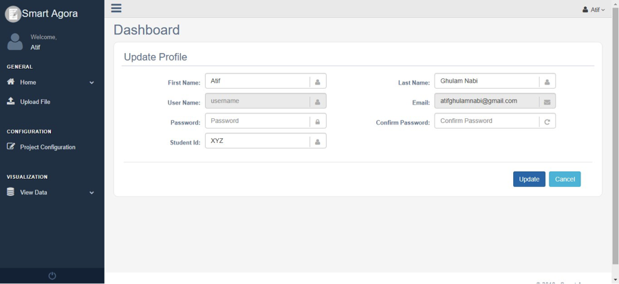

    **Update Profile**

From the dashboard’s home screen, you can proceed to crowd-source task(s). You can create projects, tasks, and assignments using the dashboard’s main menu. It’s important to note the following description of projects, tasks, and assignments before creating crowdsourcing tasks.

| **Projects**: A project is a single crowdsourcing job. Everything else you create goes under the scope of a project: data collection assets, assignments, tasks and experiment participants. A user (experiment participant) can be connected with the project using the Smart Agora App.
| **Tasks**: A task is like data storage; it contains the data collected by the individual actions on a data collection asset. For example, data collected by the experiment participants will be stored in a task. A project can have one or more tasks. It’s required to create at least one task under a project for receiving data from experiment participants. These tasks allow the data scientist to store information in an organized manner on the server. For instance, if a data scientist wants to conduct an experiment at two different occasions e.g. evening or morning time, the data scientist can create two tasks for storing the data on different occasions.

The following diagram shows the relationship between assets, assignments, and tasks.

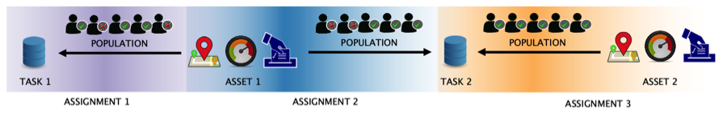

    **Relationship Diagram**

Please go to the **Project Configuration** from the left menu on the dashboard and create a new project as below.

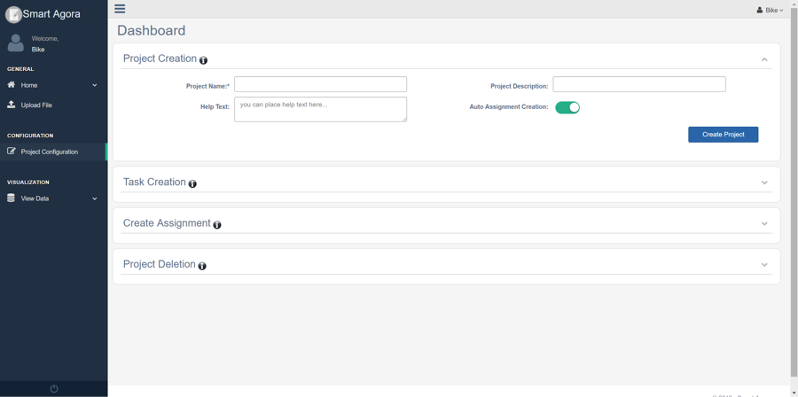

    **Create a Project**

1.	Provide any regular string in the **Project Name** field.
2.	It’s optional, additional information about the project in the **Project Description** field.
3.	It's optional, instructions about the assignment will be shown to experiment participants in Android App’s **Help Text** field.
4.	By default, Smart Agora dashboard allows data scientist(s) to create assignments manually for experiment participants who are connected with the Project from Android App, it allows data scientist to control the list of participants who can join the project. **Auto Assignment Creation** switch button provides the functionality for experiment participants to join/perform an experiment without waiting for approval from the data scientist. The data, collected from experiment participants, will be saved in the first task.
5.	Click on Create Project after providing the required information.

Next step is to create a task in the newly created project by clicking the Task Creation collapsible panel as shown below.

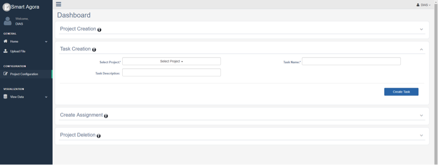

    **Create a Task**

1.	Select a project from the **Select Project** dropdown list.
2.	Provide any regular string title for the task in the **Task Name** field without any spaces.
3.	Optional additional information about **Task Description**.

You can view details of the newly created project: View Data-> Projects as follows.

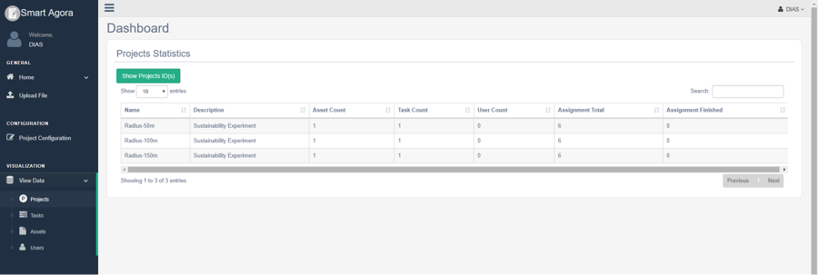

    **View Project**

**Project Statistics:**

*	Asset Count: shows the number of assets created for a project.
*	Task Count: shows the number of tasks created in a project.
*	User Count: shows the number of users connected with a project.
*	Assignment Finished: shows the number of completed assignments by the experiment participants.

You can view newly created task by selecting a project and task from View Data -> Tasks as shown below.

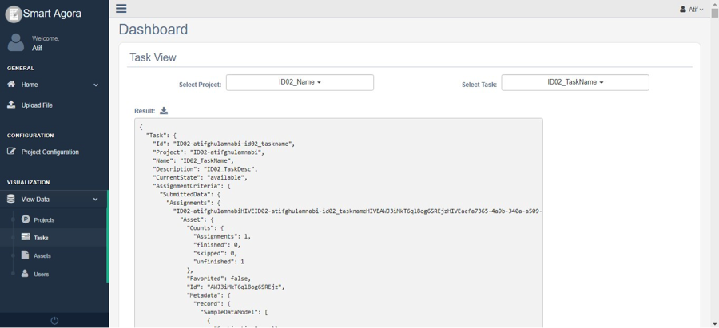

    **View Tast**

The data scientist can remove any project from the system manually by providing the ID of the project, the project ID can be viewed in the View Data-> Projects-> Show Project ID(s).

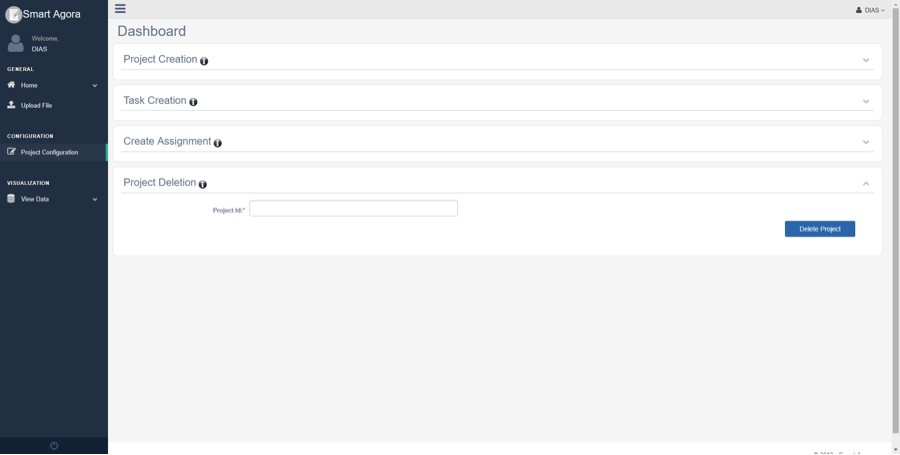

    **Removing a project**

| **Asset:** Assets are what gets assigned to users such as crowed sourcing tasks for experiment participants. A data scientist can create an asset using the dashboard. All assets are scoped to a project.
| **Assignments:** Assignment is the process of connecting an existing asset with the experiment participants. In simple words, a data scientist will create an assignment for experiment participants through the dashboard.

Asset Creation
--------------

    **Project and Mode**

| **Project:** It contains a dropdown list of projects that you already have created from Project Configuration. Select a project from the **Select Project** dropdown list in order to create an asset for the project.
| **Mode:** It contains a dropdown list of assignment modes (Simple, Sequence, Decision or DIAS Simple) required to create an asset. It provides the functionality to complete data collection asset for experiment participant in following four different settings.
1.	**Sequence:** You can create a data collection asset containing several survey questions. In sequence mode, these questions are created in ascending sequence order and experiment participants must have to follow the same sequence in order to answer all questions using the android app. For instance, if five questions are asked in a sequence, experiment participant will answer them in order (1st question, 2nd question, 3rd question and so on) before reaching the destination.
2.	**Simple:** In this case, questions are created without any sequence. Experiment participants can randomly visit and answer survey questions using the android app by visiting checkpoints on the map while walking on a street or traveling through the city.
3.	**Decision:** You can create a data collection asset with Decision mode for decision-based questions using crowd-sourcing dashboard. In this case, the next question will be asked to the experiment participant based on his answer to the previous question. For example, in a real-time scenario, if there is a question “Do you like Hbf?” for experiment participant and assume there two answers YES or NO, you may like to ask next question based on the previous answer e.g.” Take the train to airport.” or “Use bus to reach the airport”.
4.	**DIAS Simple:** It allows to create multiple Likert scale questions (with the scale values (1-10)) at any location called "group point" and experiment participants can answer questions using the android app by randomly visiting group points on the map. Android app will compute the average, of Likert scale answer(s) at each group point, and send it to Dynamic Intelligent Aggregation Service (DIAS), which returns the aggregated response of all users at the same location. For example, an experiment participant provides information of noise level at any location by answering some Likert scale questions, android app will show the aggregated response of other users on the screen who have visited the same group point. It will also show the average value of the current experiment participant on-screen for instant real-time comparison.

| Click the Next button after providing the required information.
| **Default Credits**: You can set default credit points for all questions as an incentive to motivate the involvement of experiment participants.
| **Start Address**: You can provide a start location, from where experiment participants need to begin the experiment.
| **Destination Address**: Similarly, provide a destination location where the experiment is supposed to be finished.

Alternatively, you can also select start and destination locations by placing the cursor in the input field and click at the desired location on the map.

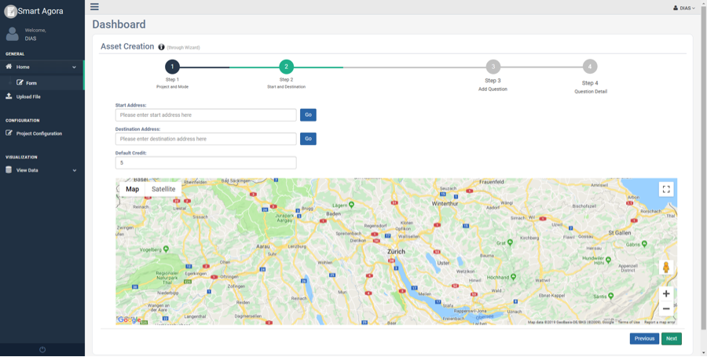

    **Start and Destination (Decision or Sequence mode)**

Note: There is an option to provide start and destination location in case of Sequence or Decision modes as shown in :numref:`Figure 13`.

.. _Figure 13:
.. figure:: smart.agora/Figure_13.png

    **Start and Destination (Simple or DIAS Simple mode)**

Click the Next button after providing the required information, you will see the main screen for asset creation as shown in :numref:`Figure 14`:

.. _Figure 14:
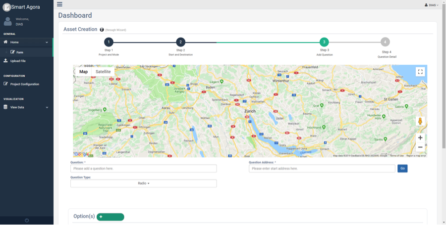

    **Asset Creation**

**Asset Creation** page consists of following sub-sections with collapsible panels.

 *	Question(s)
 *	Options
 *	Advanced Options
 *	Added Questions

**Question(s)**:
This section contains information to define questions for experiment participants. You can define questions at any location, and experiment participant will answer them by visiting checkpoints on the map using the android application.

.. _Figure 15:

    **Question (Sequence, Decision or Simple Mode)**

| Provide information in question(s) section as following:
| **Question**: write a question that you want to ask from experiment participant(s).
| **Question Address**: provide the desired location for question in ‘Question Address’ input field and visualize marker on the map. It also allows selecting locations by placing the cursor in the ‘Question Address’ input field and clicking at the desired location on the map as shown in Figure 15.
| **Question Type**: there are four types of questions (i.e. radio button, checkbox, Likert scale, and text box). You can select any type for creating questions according to the requirement.
| **Visibility**: this switch button is checked by default, to show question markers on the map for experiment participants. You can also make it unchecked, experiment participants will not be able to see checkpoints or markers of questions on the map.
| **Mandatory**: this option is unchecked by default; it allows experiment participants to cancel the question if they do not want to answer it. You can mark it checked as mandatory so that user may not ignore it, in this case, ‘cancel’ button will not be enabled on question popup screen in android app.
| **Show Credit**: You can show the credit points to experiment participants for every option of the question by checking this option. It’s unchecked by default.

Note: DIAS Simple mode supports only Likert Scale question type.

**Option(s)**: You can add possible answers to every question along with a choice to define credit points for each option in case if selected question type is Radio or Checkbox.

**Advanced Option(s)**: In advanced option(s) section you can set following advanced option(s) for while creating a question.

a.	**Time (s)**: time in seconds to record sensors’ information where the question will be asked on the map. By default, the value of time is 3 seconds.
b.	**Frequency**: frequency can be set to high, low or medium to record sensors’ information. By default, the selected value of frequency is ’Medium’.
c.	**Sensors**: You can select more than one sensor from the dropdown list to get the contextual information at the location of question. There are six types of sensors (Light, Gyroscope, Proximity, Accelerometer, Location, Noise) available to collect data from experiment participants at specific locations. By default, the selected value of the sensor is ‘Location’.
d.	**Vicinity**: It is the range of the user to access checkpoints on the map (the distance from the user’s current position to the boundary of the ellipse while using the android app).

Click ‘Add Question’ button after providing the necessary details of the question, it will be added into the grid as shown in :numref:`Figure 21`.

.. _Figure 16:
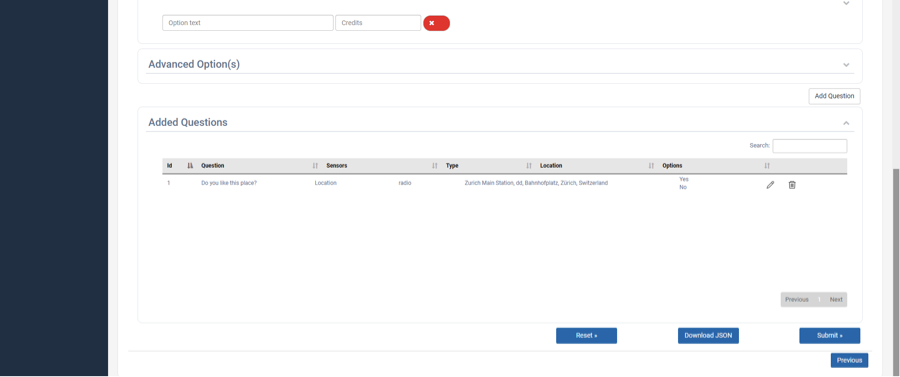

    **Questions Grid**

| **Associate Questions (Decision Mode):**
| If Decision Mode is selected from the assignment Mode dropdown list, ‘Associate Question’ button will appear on added questions’ panel as shown below:

.. _Figure 17:
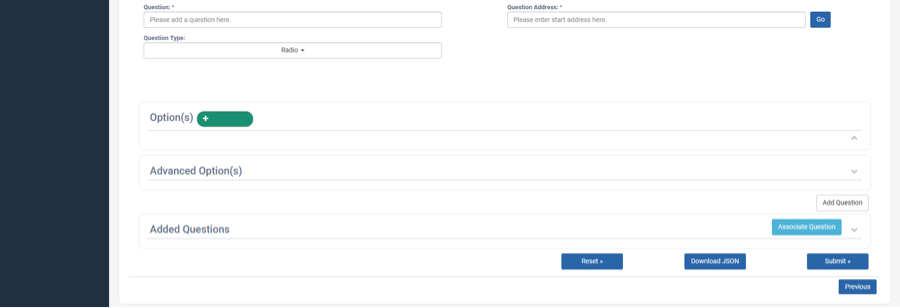

    **Decision Mode Associate Question Button**

It’s required to add at least two questions in the data collection asset for creating an association between questions. If you click on the Associate Question, a pop-up window will appear to create an association among the added questions as shown below:

.. _Figure 18:
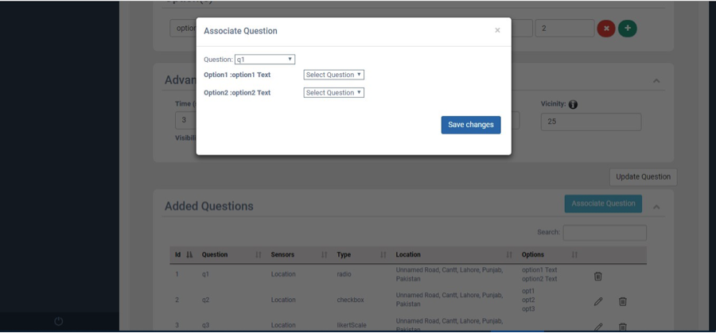

    **Decision-Mode with Radio Button (Associate Question)**

‘Question’ dropdown list will show all the questions that you have added in questions grid. You can select a question from the dropdown list to create an association with any other question. By selecting the question, it will show all possible answers i.e. options of question. You can configure the next question for every available option or combination in the selected question. Click the save button every time you associate a question on popup window as shown in :numref:`Figure 18`. If you have associated all questions, click the close button and submit data collection asset to server.

*	If Decision Mode is selected and type of question is Checkbox, there might be more than one options to answer a question e.g.
  What caused you difficulty at these buildings?
    * Parking problems
    * Reception area
    * Difficulty with transport
  which means participants can select more than one options, so the next question can be asked based on one or the combination of more than one checkbox options. If you define more than one options for checkbox question, all possible combinations will be generated on the screen as shown in :numref:`Figure 19`. It’s allowed to create only seven options for a question if the type of question is a checkbox.

.. _Figure 19:
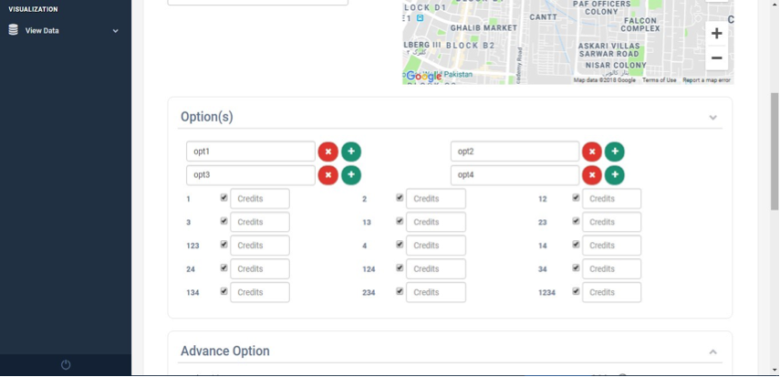

    **Decision Mode checkbox combinations**

You can simply associate question for each possible combination, as shown in :numref:`Figure 20`. Similarly, save all associations and close the popup window.

.. _Figure 20:
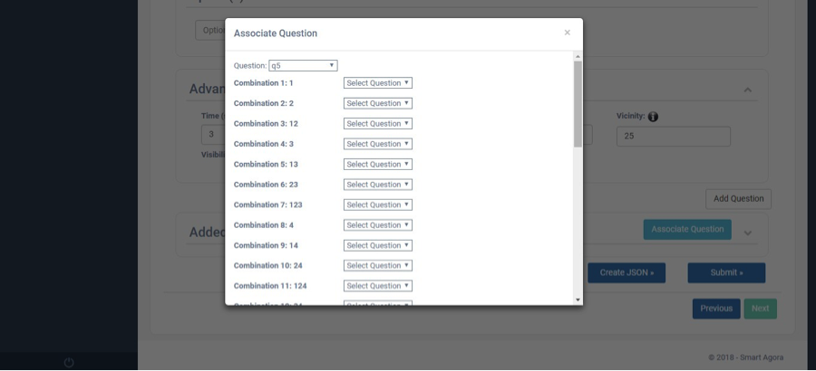

    **Decision-Mode with Checkbox(Associate Question)**

Please click on the Add Question after providing the required information. Question will be added in the data grid, allowing users to update or delete it from the grid as shown in :numref:`Figure 21`.

.. _Figure 21:
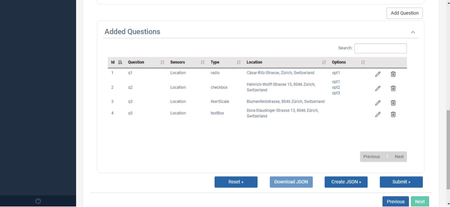

    **Question Grid**

| Similarly, you can add more questions one by one repeating the above steps.
| Once you have defined all questions with required configurations, you can finally submit the created asset to the server by clicking on **Submit**. You will see a ‘success’ notification if an asset has successfully been submitted to the server.
| In order to verify the submitted asset on the server, you will see an increment in ‘Asset Count’ column from View Data -> Projects as shown in Figure 8. Similarly, you can view the submitted assets from View Data -> Assets.
| **Uploading File**
| There is an additional option in the left menu to upload the data collection asset manually from the dashboard as shown in Figure 18. It’s mandatory to follow the schema of the asset file for uploading an asset file manually.  You can also create a sample JSON file from asset creation screen by adding questions into data grid, then download the file to visualize the schema.

.. _Figure 22:
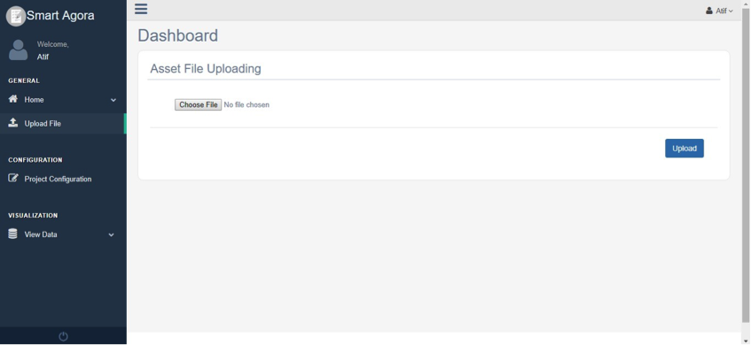

    **Upload Data Collection Asset Manually**

Chapter 3 - Smart Agora Android application
*******************************************

Smart Agora Android Application fosters for data scientists a more informed data collection approach at relevant public spaces. By encouraging physical presence in an augmented and gamified way, experiment participants visit public spaces more evidently and can collect highly relevant data about their environment. The experiment participant moves in the urban environment via different transport means or on foot. Physical presence provides to experiment, participants, the opportunity to witness points of interest in which data collection is required. The physical space turns to an augmented and gamified landscape for data collection.

Specifications for app installation:
------------------------------------

| **API level (Platform version)**: There have been many major changes between API versions in android. Smart Agora supports minimum API level 15 (Android version= 4.0.3) and highest API level 24 (android version=7.0) for device compatibility.
| **Device capabilities**: Your android device should have the following capabilities: GPS, Gyroscope, Accelerometer, Light Sensor.
| **Device Permissions**: Smart Agora requires following permissions before installation: Internet, location, Nervousnet HUB API (for sensors), Storage.
| **Installation**:
| Please install "**Smart Agora**" android application from a shared location. By default, Android devices cannot install apps from sources other than the Google Play Store. To install apps manually, you'll need to allow your device to install apps from other sources. You may need the following steps to enable manual installation of android APK.
*	Please open the **Settings** on your android device.
*	Tap "**Security**". it will open the Security menu.
*	Scroll down and check the "Unknown sources" box. Tap "OK" to confirm that you want to enable this.

*	Download Smart Agora APK directly to your device from a shared location. Navigate to the location of the downloaded APK file installation.
*	Tap the APK. This will immediately open the installer for the app. You can review the permissions before the app is installed, you will see a list of the services that it will have access to.
*	Tap "Install" to install the app. The app will automatically install, and an icon for it will be added to your Home screen. You can tap the "Open" button in the installer to open it immediately.

Smart Agora
-----------

1. Start the application by clicking the app icon on your android device. A splash screen will appear for a few seconds meanwhile application loads its resources.
  .. _Figure 23:
  .. figure:: smart.agora/Figure_23.png

      **Smart Agora - Splash Screen**

2. The application will ask the user to turn the GPS on if it is disabled on the android device as shown in Figure 25. It will show the current location of the user after activating the GPS.
  .. _Figure 24:
  .. figure:: smart.agora/Figure_24.png

      **Smart Agora - Enable GPS**

3. You will land on the home screen after turning on the GPS location. Home screen consists of the following functionalities:
  .. _Figure 25:
  .. figure:: smart.agora/Figure_25.png

      **Smart Agora - Right Menu**

There is a right menu option in smart agora app, available on the right side of header, mainly to select projects and get new assignments as shown :numref:`Figure 25`.

Experiment participant can select a project by providing data scientist code, sync assignments (to get new assignments), load an assignment to perform an experiment and mark an assignment as ‘complete’ by clicking on Submit Assignment from right menu option. If an experiment participant has already completed an assignment or submitted it manually from right menu, it will not be shown after sync. assignments.

If a data scientist is registered at the crowed-sourcing dashboard with an email e.g. datascientist@gmail.com, the user name (i.e. datascientist) will be considered as code of data scientist to access their projects.

.. _Figure 26:
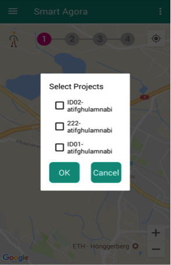

    **Available Projects**

| In order to get an assignment, each android user needs to connect with a project at first. Please click on the Select Project from the right menu. All available projects will be shown to you as appeared in :numref:`Figure 26` after providing data scientist code. You may connect with one project at a time, and can access assignment from that project.
| Experiment participants cannot see other data scientists’ projects.

If an experiment participant is connected with a project, data scientists can visit the crowd-sourcing dashboard and create an assignment for the experiment participant from dashboard following Projects Configuration -> Create Assignment as shown in :numref:`Figure 27`.

.. _Figure 27:
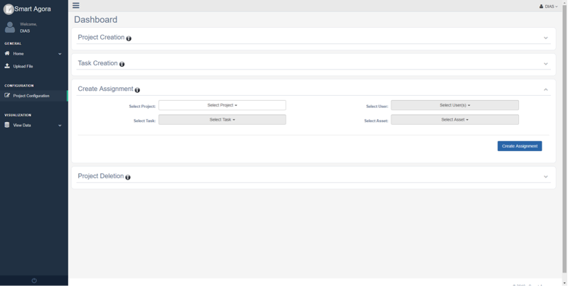

    **Dashboard - Create Assignment**

| Data scientists can also see all users connected with a project from View Data->Users.
| Experiment participant can click on Sync Assignments from the bottom menu in the Android app to synchronize with the server and get assignments that are assigned by the data scientist.  Experiment participant can click on Sync. Assignment from the bottom menu to select an assignment from the assigned tasks.

.. _Figure 28:
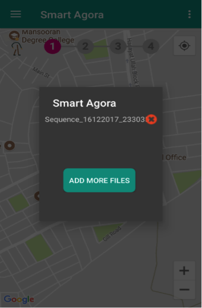

    **Available Assignments**

Tap on the assignment (e.g. Sequence_16122017_23303) to load into the map as show in :numref:`Figure 28`. In addition, there is a cross icon with every file to delete it from application. If data participant has deleted an assignment by mistake, it can be reloaded from server by clicking Sync. Assignment from right menu options of smart agora. If an assignment has already been marked as completed, it cannot be opened or submitted again.

.. _Figure 29:
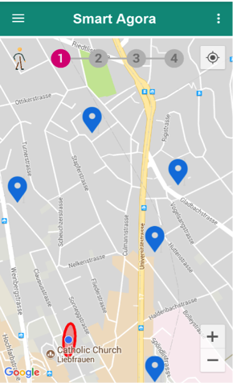

    **Assignment loaded on the map**

Experiment participant's current position will be shown with an ellipse around his current location after loading the assignment as show in :numref:`Figure 29`.

| When an experiment participant loads an assignment in the Smart Agora app and starts to perform the experiment by moving into the public space, the application will draw an ellipse around the current location of the participant’s application as shown in Figure 30. Smart Agora app will check if a checkpoint/ question marker enters into the vicinity of the ellipse, and then a popup window will appear to ask a question from the participant and sensors’ information will be recorded.
| It’s required to select an appropriate transport meanwhile performing an experiment. For example, if a participant is walking, the application will check after every 7 seconds to see if a question marker enters into the vicinity of the experiment participant.

* Car: 1 second
* Train: 0.5 second
* Walk: 7 seconds
* Bicycle: 6 seconds

.. _Figure 30:
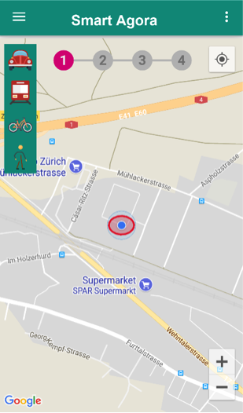

    **Smart Agora - Transport Means**

There is a transport menu available on left side in application to change transport means by selecting an icon for walking, car, bus or tram once the assignment has been loaded in the application. By default, the selected transport mean is walking as shown in :numref:`Figure 30`.

If an experiment participant does not follow the route on the map and is not within the specified tolerance, then a message “Please follow the route.” will be shown to the user. The tolerance is set to 50 meters and application will add GPS accuracy value in this tolerance. This rule (i.e. “Please follow the route”) isn’t applicable for Simple and DIAS Simple mode, because the questions are distributed on the map at different locations without start & destination locations and the participant don’t need to follow a route] By default, the tolerance is set to 50m.

You can also see a state progress bar on the home screen, it shows the progress while completing an assignment. If an assignment is completed successfully, all states of the progress bar are marked.

.. _Figure 31:
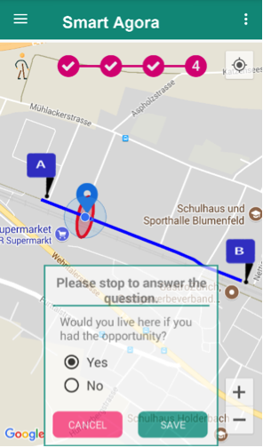

    **Smart Agora - Question pop up**

If a question comes into the vicinity  of a user, a pop up will appear to ask a survey question to the user as shown in :numref:`Figure 31`.

.. _Figure 32:
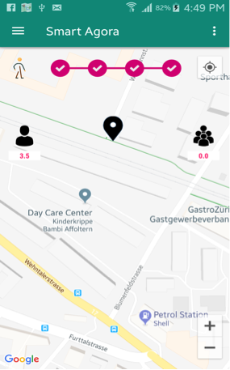

    **DIAS Simple Mode**

In DIAS Simple mode you can see your average response and aggregated response of other participants at the same location as shown in :numref:`Figure 32`.

.. _Figure 33:
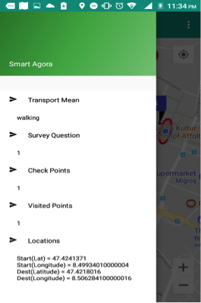

    **Smart Agora - Left Menu**

i. Transport Mean:  It shows a selected transport mean from home screen.
ii. Survey Questions: It shows total number of questions to be asked in case of simple and sequence mode.
iii. Location: It shows coordinates of starting and destination location.
iv. Check Points: It shows total number of checkpoints on the map.
v. Visited Points: It shows the number of visited checkpoints.

.. _Figure 34:
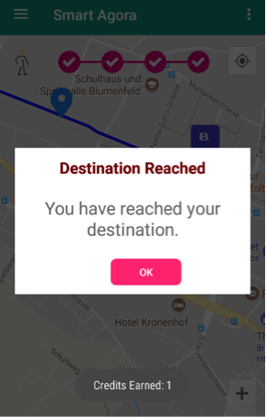

    **Smart Agora - Destination Reached**

When the user is reached at destination, a pop-up will appear “Destination Reached” as shown below. Application asks the user to click OK button and the completed assignment is submitted to the server and user returns to home screen after clicking OK. Similarly, multiple assignments can be completed repeating the same steps.

If an experiment participant has completed an assignment by visiting all questions on the map, it will be submitted to the server. Data scientists can visit the dashboard again to see an increment into Assignment Finished counter from Projects Configuration-> All Projects.

Data scientists can access data of all completed assignments and sensors’ data in JSON format from the dashboard in order to perform analysis on the data.
View Data -> Tasks. It also allows downloading JSON file from Result icon as shown below.

.. _Figure 35:
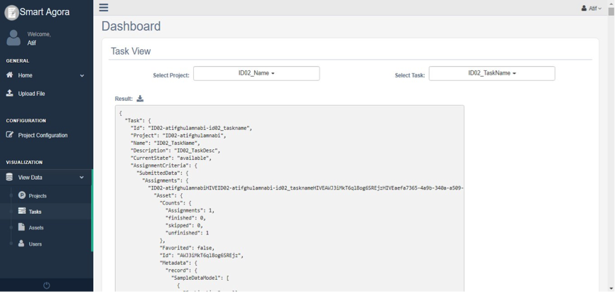

    **View Task**

There is an additional option to access data files (i.e. completed assignments & sensors’ data) from the device’s internal storage (Mydevice/Android/data/nervousnet.ethz.ch/files/Assignments) in case of any problem in network connection to the server.
