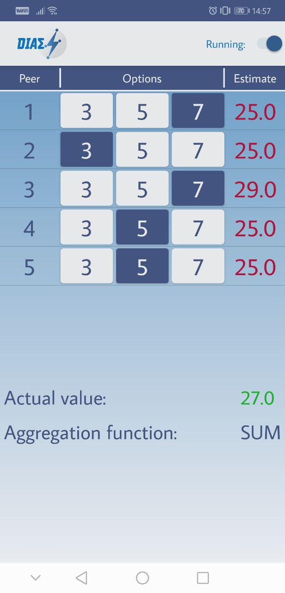

.. highlight:: java
******************
DIAS Proof Of Concept Application
******************

Introduction
------------
This documentation explains everything you need to know about the DIASProofOfConcept application and how to use it.
The DIASProofOfConcept application is a simple application, which visualises the functions of the DIAS server, to show it's correctness.

Use case
--------
The application is solely intended to show the correctness and stability of the connected DIAS server.

Installation
------------
To use this application, one need only to import the project into android studio and then install the application on the desired android device.

Usage
-----
This section explains everything you need to know to correctly use the application.

Start up
##############
To start the application and initialise the connections, one has to press the switch on the top right corner of the screen.
On the left of the button, there is a text writing "Running:".

Once the connections are established, there should be multiple entries in the list. How many entries this list has, depends on how many threads are selected in the sittings. More to that later on.
Each entry stands for one separate connection with a peer of the DIAS server. To distinguish them, there is an enumeration in the left entry of each row.

.. image:: DIASProofOfConcept/NotStarted.png

Changing of values
######################
In the centre of each row, there are three buttons with different values. The values can be changed in the settings.
To change a value of a specific peer, one simply clicks on the desired value.
The chosen value (and thus the value, which the server sees) is always the one with a blue background.

.. image:: DIASProofOfConcept/Select.png

Checking for correctness
##########################
On the right side of each row, there is the value received for the respective peer from the server.
During the convergence process on the server, it can happen, that different peers see different values.

On the bottom, the internally calculated aggregation is shown. Once the value of a peer is the same as the internally aggregated one, the color of the received value of the respective peers changes to green.
The aggregation function can be changed in the settings.

**Note:** As the values get calculated in the phone internally, only the peers from the list above are taken into consideration.
As an example: Let's assume the aggregation function "SUM" is selected. If 5 peers are connected over the app, all having selected the value 3, and 3 external peers with values 3 also. The app would show the "actual value" of 15, even if the correct value on the server side would be 24.

**Note:** The server is not stable with no peers online at all. For this purpose, there are always 10 mock-peers online, which do not change states. They are however taken into consideration when checking for correct aggregates (e.g. if aggregation function "AVG" is selected).
If those 10 mock-peers on the server would be removed, one needs also to change the correction in the app:
The line
::
	int mockPeers = 10;
needs to be changed to
::
	int mockPeers = 0;

.. image:: DIASProofOfConcept/WrongAndRightAgg.png
	:width: 30 %
.. image:: DIASProofOfConcept/RightAgg.png
	:width: 30 %

On the left, all estimates are incorrect. In the middle, some of the entries have correct estimates. On the right, all entries have correct estimates.

Changing the settings
#####################
To access the settings menu, one needs to quickly tap the DIAS logo in the top left corner five times.
It is hidden, such that upon demonstration, the user does not change settings by accidentally accessing the settings window. The only one having access should be the demonstrator.

In the settings, one can change the number of peers connected ("No. of Threads", between 1 and 10), the value of the left button ("V1"), of the middle button ("V2"), of the right Button ("V3"), and the aggregation function ("aggregation type").

Problems
--------
If any of the entries show "--" in the "Estimate" section, it means that this peer could not receive a value from the server.
This could be because the corresponding peer crashed, the server is not running at all, or the connection itself could not be established.
The latter one could be because the server or the phone itself has no connection to the internet.

.. image:: DIASProofOfConcept/Null.png
