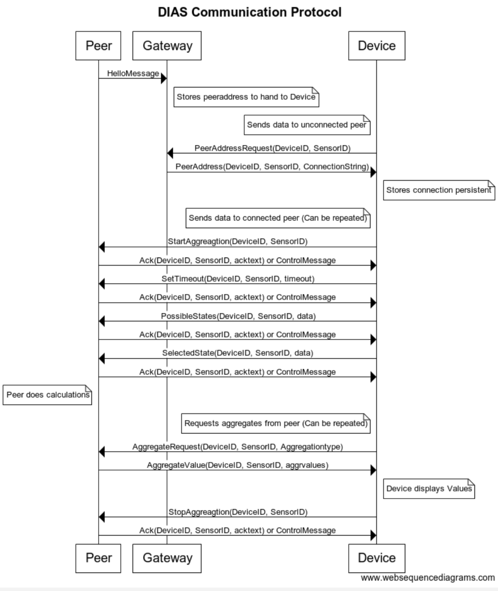

.. _label_dias_gateway:

DIAS Gateway
************

  The message sequence between the gateway and a newly connecting peer

The gateway establishes initial connections between external devices and DIAS peers.
The device is expected to keep the received connection, but the gateway is able to return the peer address again, in case the device lost it for some reason.

The connection mapping is a mapping between (deviceID, sensorID) and peerAddress.
